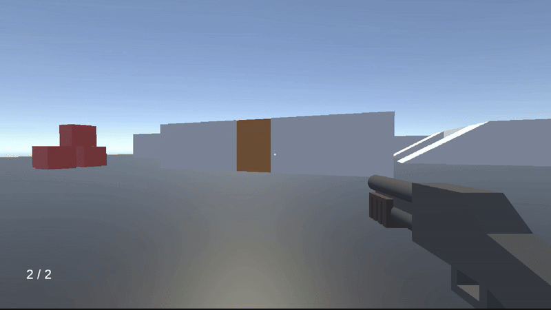

# FPS Gameplay Framework
A first person action game framework built in Unity (C#)

## Key Features
### Player Movement and Camera System
* Physics based first person character controller (walking, jumping, sliding)  
* Smooth first person camera movement with screenshake and recoil effects

### Enemy AI and Behaviour
* 2 enemy archetypes:
  * Melee enemies with animation driven attacks
  * Ranged enemies with targeting
* Finite State Machine
  * Controls patrol → chase → attack → reload behaviour state and transition
* Decision Making
  * Enemy behaviour decision making based on field of view and line of sight calculations (customizable)
* Pathfinding
  * Enemy pathfinding based navigation to dynamically track player in attack state using NavMesh

### Weapon System
* Modular weapon manager system supporting both player controlled and enemy controlled weapons
* State based weapon logic to handle attack, reload and cooldown weapon states

### World Interaction and Environment
* Interaction system for picking up, dropping and throwing weapons  
* Destructible and interactable environment (ex breakable doors)

### Gameplay

